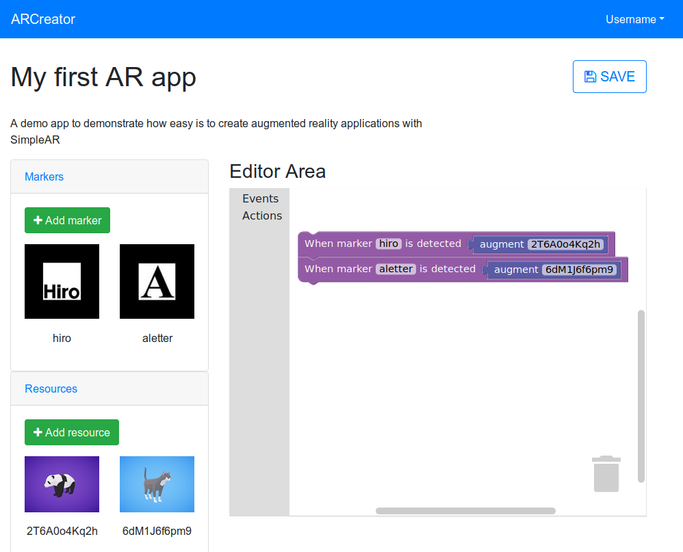

# SimpleAR - CREATOR

SimpleAR Creator is an Augmented Reality Authoring Tool using [Google Blockly](https://developers.google.com/blockly/). Through visual programming, you can create augmented reality apps.



## Installing / Getting started

1. Install NPM
2. Run the following commands:

```shell
npm install
npm start
```

This will start a server on localhost:4200 and open the desktop app on development mode. For running on Linux, you need to install libgconf:

```shell
sudo apt-get install libgconf-2-4
```

### Firebase configuration

Create a new Firebase app on the [Firebase console](https://console.firebase.google.com/) with your Google Account by clicking on ``Add project`` and typing a name for your app.

Then click on ``Add Firebase to your web app``, and copy the config info (available under Authentication tab, then click on Web Setup on the upper right corner) on the ``environment.firebase`` fields into [src/environments/environment.ts](src/environments/environment.ts), do the same to [src/environments/environment.prod.ts](src/environments/environment.prod.ts).

Go to Database > Rules, and enable anonymous access by copying the following on the text box:

```
{
  "rules": {
    ".read": true,
    ".write": true
  }
}
```

### Poly API configuration

Follow the [Poly API Guide](https://developers.google.com/poly/develop/api) to get a Poly API Key, then put the key on the ``environment.poly.apiKey`` into [src/environments/environment.ts](src/environments/environment.ts), do the same to [src/environments/environment.prod.ts](src/environments/environment.prod.ts).


Finally, to prevent your keys from being exposed on Github, use the following commands:

```shell
git update-index --assume-unchanged src/environments/environment.ts
git update-index --assume-unchanged src/environments/environment.prod.ts
```

## Developing

After following the steps from [Getting started](#installing--getting-started), do the next steps:

1. Install Angular CLI

```shell
sudo npm install -g @angular/cli
```

## TO-DOs

- Add i18n
- Fix editor resizable

## Licensing

The code in this project is licensed under [MIT License](LICENSE.md).
