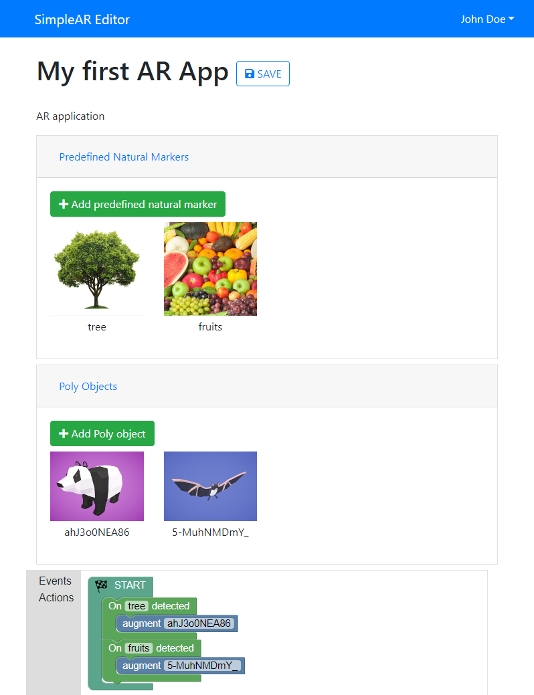

# SimpleAR [CREATOR]

SimpleAR Creator is an Augmented Reality Authoring Tool using [Google Blockly](https://developers.google.com/blockly/). Through visual programming, you can create augmented reality apps.



## Installing / Getting started

```shell
npm start
```

This will start a server on localhost:4200 and open the desktop app on development mode.

## Licensing

The code in this project is licensed under [MIT License](LICENSE.md).